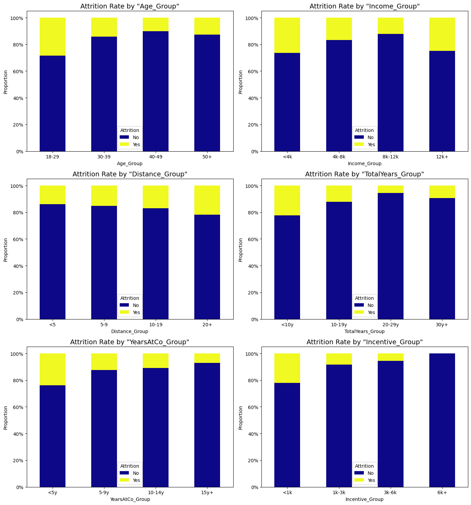
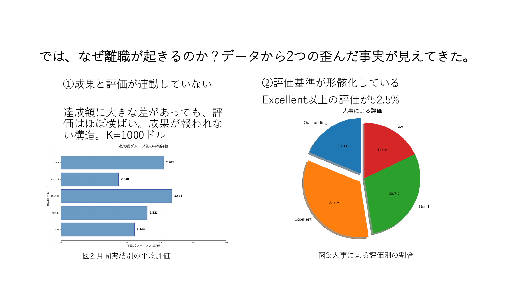
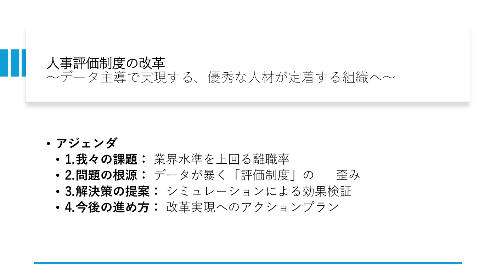

# Employee-Attrition-Analysis-HR-Strategy-Proposal

HR analytics case study using EDA and LightGBM to identify attrition drivers and propose data-driven retention measures.

**架空企業を対象とした教育用ケーススタディ**です。実在企業への導入実績や施策の実証結果ではありません。

- **報告 ROC AUC：0.8486** — 最終提案PDFに記載されたLightGBMの評価値。最終コード・評価条件が未収録のため再現は未確認です。
- **1,470人・44項目のEDA** — 保存出力では離職238人、離職割合16.19%。報酬・職種・ストレスなどと離職の関連を探索しました。
- **定着施策の仮説を提案** — 高実績者の月給・インセンティブを20%増やすモデル上のシミュレーション。資料の「1.09%低下」は実際の介入による因果効果ではありません。

## 分析と提案

EDAで人事評価と報酬の関連を探索し、LightGBMによる離職予測を施策検討に用いました。予測モデルが示す関連を手掛かりに、公正な評価・報酬制度の見直しを提案するプロジェクトです。

[分析Notebook](架空企業の課題分析.ipynb) · [提案PDF（原資料）](企業の課題分析と提案.pdf) · [データの出典・利用条件](data/README.md)

## 主要な分析グラフ

### 属性・報酬区分別の離職割合



元Notebookの保存出力を抽出しました。黄色が離職者の割合です。区分ごとの人数・信頼区間は図に含まれておらず、少数群や交絡の影響に注意が必要です。報酬を操作した場合の効果を表す図ではありません。

### 実績と人事評価の関係



提案PDFの3ページです。「評価制度の歪み」は当時の提案上の解釈であり、この集計だけで制度の問題や離職の原因を確定できません。

## ベースラインと最終モデル

| モデル・位置付け | ROC AUC | 評価条件・確認状況 |
| --- | ---: | --- |
| 定数確率ベースライン（追加） | 0.5000（理論値） | 全員に学習データの離職割合を予測。両クラスがある検証集合で成立。実測値ではない |
| 公開Notebookの旧試行LightGBM | 0.8079 | 保存ログは0.807887。70/30分割、random_state=0、非層化。検証集合で早期終了 |
| 最終提案LightGBM | **0.8486（報告値）** | PDF 6ページ。最終コード、分割条件、調整履歴は未収録 |

**同一条件での改善幅を示す比較表ではありません。** 旧Notebook末尾の `make_classification` は別の合成データを使うデモだったため、同じ人事データの検証集合で定数ベースラインと試行LightGBMを比較するコードに変更しました。修正版では層化分割、カテゴリ処理、ID・定数列の除外も行うため、旧報告値と結果が異なる可能性があります。再実行結果は未取得です。

ROC AUCは離職者と非離職者を順位付けする識別性能の指標です。正解率84.86%や予測確率の正確さを意味しません。早期終了に使った検証集合のスコアは、独立テスト性能ではありません。

## シミュレーションと原資料の訂正

提案資料の7ページでは、高実績者の月給・インセンティブを20%向上させるシミュレーションを行い、離職リスクの予測値が1.09%低下するという試算を示しました。これは学習済みモデルへの入力変更による仮想的な予測であり、昇給による因果効果や実際の離職率低下を実証していません。対象者の定義、変更前後の予測値、集計方法、計算コードが未収録のため、**1.09%が相対減少か1.09パーセントポイント差かは未確認**です。

原資料を読む際は、次の訂正を併せて参照してください。

- **6ページ：** 本文は月給が最重要としていますが、図の最上位は `Incentive`、次いで `StressRating`、`JobLevel` です。本文と図は不一致です。特徴量重要度から離職の原因や評価制度の機能不全は断定できません。
- **7ページ：** 「定着に直接的な効果」は未実証です。施策候補を検討するためのモデル上の仮説として解釈してください。
- **8ページ：** ストレス変化「+0.008%」の計算・不確実性・検定結果は確認できません。「統計的に影響はない」「安全に実行可能」との結論は支持できません。
- **2・5ページ：** 業界比較や離職コストは提案時の参考情報・仮定です。架空データの離職割合と外部統計の年間離職率は定義・期間・母集団の一致が未確認であり、実際の超過離職や損失額として扱えません。

## データの出典・利用条件

東京大学GCIの最終課題として作成しました。元Notebookは提供CSV `data.csv_最終` を参照していますが、**配布元URL・ライセンス・再配布条件は未確認**です。データ本体は収録していません。IBM HRデータと似た列があっても、同一のデータや利用許諾とは断定しません。

利用権限のある提供データを用意し、提供元の条件に従ってください。詳細と確認が必要な項目は [data/README.md](data/README.md) に記載しています。

## Notebookの実行手順

Python 3.11〜3.12を対象にしています。依存関係は互換範囲の指定で、元の実行環境を固定したものではありません。

```bash
git clone https://github.com/ruy00803/Employee-Attrition-Analysis-HR-Strategy-Proposal.git
cd Employee-Attrition-Analysis-HR-Strategy-Proposal
python3.12 -m venv .venv
source .venv/bin/activate
# Windows PowerShell: .venv\Scripts\Activate.ps1
python -m pip install -r requirements.txt
python -m jupyter lab
```

1. 利用権限のある元の提供CSVを `data/data.csv` に配置します。別の場所ならJupyter起動前に `ATTRITION_DATA_PATH` 環境変数を設定します。
2. `架空企業の課題分析.ipynb` を開き、カーネルを再起動して先頭から全セルを実行します。
3. 末尾で、同一検証集合の定数ベースラインと試行LightGBMのROC AUC・Average precisionを確認します。

Colabではリポジトリ内の依存関係をインストールし、提供CSVをアップロードして `ATTRITION_DATA_PATH` をそのパスに設定してください。Google Driveのマウントは必須ではありません。macOSでLightGBMの `libomp` 読み込みエラーが出る場合は `brew install libomp` を実行します。

検証済み：Python 3.12で依存関係のインストール、Notebook形式・全セル構文・ローカルリンクの確認、44列のテスト用合成データによる全コードセルの順次実行。これは元データによる分析結果の再現検証ではありません。

CSVがない状態では読み込みセルで説明付きエラーになります。PDFの最終AUC・報酬シミュレーションはこのNotebookから再現できません。旧保存出力を修正版の実行結果と誤認しないよう、Notebookの出力はクリアしています。

## 分析の限界と倫理的注意点

- 教育用の架空データであり、実在企業・他業種・将来の従業員への一般化は未検証です。
- 単一分割と検証集合での早期終了に依存します。独立テスト、時系列検証、交差検証、信頼区間、確率校正は今後の課題です。
- 離職は約16%の不均衡クラスです。運用には適合率・再現率、閾値ごとの誤検知コストも必要です。
- 年齢・性別・婚姻状況などの属性や代理変数による偏りを点検し、属性別の誤判定率を評価する必要があります。
- 個人の離職予測を解雇、採用拒否、昇進・処遇の不利益な自動判断に利用しないでください。人による確認と、従業員への説明・異議申立ての機会が必要です。
- 実データを扱う場合は目的を限定し、アクセス権限・保存期間・匿名化を設計してください。ストレス情報を含む個票を公開リポジトリへ登録しないでください。
- 報酬変更による実際の効果と副作用は、本人の納得、公平性、費用を考慮した介入評価で別途検証する必要があります。

## 提案資料

[](企業の課題分析と提案.pdf)

[提案PDFを開く（全9ページ）](企業の課題分析と提案.pdf) — 原資料を保存しています。上記「シミュレーションと原資料の訂正」を併せてお読みください。

図表と旧試行AUCの出典：[修正前の公開版（8b9d354）](https://github.com/ruy00803/Employee-Attrition-Analysis-HR-Strategy-Proposal/tree/8b9d354)。図は原資料・保存出力からの抽出で、今回の再学習結果ではありません。
